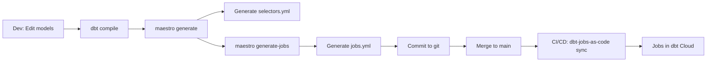

# Deployment Guide

This guide shows how to deploy selectors and jobs to dbt Cloud using CI/CD.

## Overview

**dbt-job-maestro** generates YAML files that define your selectors and jobs:
- `selectors.yml` - dbt selector definitions
- `jobs.yml` - dbt Cloud job definitions

**dbt-jobs-as-code** (from dbt-labs) deploys these files to dbt Cloud via API.

## Workflow



## Setup

### 1. Install dbt-job-maestro

```bash
pip install dbt-job-maestro
```

### 2. Add dbt-jobs-as-code to packages.yml

```yaml
# packages.yml
packages:
  - git: https://github.com/dbt-labs/dbt-jobs-as-code.git
    revision: main
```

Then install:

```bash
dbt deps
```

### 3. Configure dbt-job-maestro

Create `maestro-config.yml`:

```yaml
manifest_path: target/manifest.json
selectors_output_file: selectors.yml
jobs_output_file: jobs.yml

selector:
  method: fqn
  exclude_tags:
    - deprecated

job:
  account_id: 12345      # Your dbt Cloud account ID
  project_id: 67890      # Your dbt Cloud project ID
  environment_id: 11111  # Your production environment ID
  threads: 8
  target_name: prod
  cron_schedule: "0 */6 * * *"

deployment:
  deploy_branch: main
  require_dbt_jobs_as_code: true
```

## Local Development

### Generate Selectors

```bash
# Compile dbt project
dbt compile

# Generate selectors
maestro generate --config maestro-config.yml

# Review selectors.yml
cat selectors.yml
```

### Generate Jobs

```bash
# Generate jobs from selectors
maestro generate-jobs --config maestro-config.yml

# Review jobs.yml
cat jobs.yml
```

### Commit Changes

```bash
git add selectors.yml jobs.yml maestro-config.yml
git commit -m "Update selectors and jobs"
git push origin feature/update-selectors
```

## CI/CD Setup

### Option 1: GitHub Actions

Create `.github/workflows/deploy-dbt-jobs.yml`:

```yaml
name: Deploy DBT Jobs

on:
  push:
    branches:
      - main
    paths:
      - 'jobs.yml'
      - 'selectors.yml'

jobs:
  deploy-jobs:
    runs-on: ubuntu-latest

    steps:
      - name: Checkout code
        uses: actions/checkout@v3

      - name: Setup Python
        uses: actions/setup-python@v4
        with:
          python-version: '3.10'

      - name: Install dbt-jobs-as-code
        run: |
          pip install git+https://github.com/dbt-labs/dbt-jobs-as-code.git

      - name: Deploy jobs to dbt Cloud
        env:
          DBT_CLOUD_SERVICE_TOKEN: ${{ secrets.DBT_CLOUD_SERVICE_TOKEN }}
        run: |
          dbt-jobs-as-code sync-jobs jobs.yml

      - name: Success
        run: echo "✅ Jobs deployed to dbt Cloud"
```

**Required Secrets:**
- `DBT_CLOUD_SERVICE_TOKEN`: Create in dbt Cloud under Account Settings > Service Tokens

### Option 2: GitLab CI

Create `.gitlab-ci.yml`:

```yaml
deploy-dbt-jobs:
  stage: deploy
  image: python:3.10
  only:
    - main
  changes:
    - jobs.yml
    - selectors.yml
  script:
    - pip install git+https://github.com/dbt-labs/dbt-jobs-as-code.git
    - dbt-jobs-as-code sync-jobs jobs.yml
  variables:
    DBT_CLOUD_SERVICE_TOKEN: $DBT_CLOUD_SERVICE_TOKEN
```

### Option 3: Manual Deployment

```bash
# On main branch after merge
git checkout main
git pull

# Deploy jobs
dbt-jobs-as-code sync-jobs jobs.yml
```

## Branch Protection

Configure branch protection to prevent concurrent deployments:

### GitHub

1. Go to Settings > Branches
2. Add rule for `main` branch
3. Enable:
   - Require pull request reviews
   - Require status checks to pass
   - Do not allow bypassing

### GitLab

1. Go to Settings > Repository > Protected Branches
2. Select `main` branch
3. Set:
   - Allowed to merge: Maintainers
   - Allowed to push: No one

## Validation

Before deploying, validate your setup using the `maestro check` command:

```bash
# Basic check
maestro check

# Check with config file
maestro check --config maestro-config.yml

# Check specific dbt project directory
maestro check --dbt-project ./my-dbt-project
```

This validates:
- dbt-jobs-as-code package is installed
- Current git branch matches deployment branch
- packages.yml configuration
- Required files exist (selectors.yml, jobs.yml)

Or use the Python API:

```python
# validate_deployment.py
from dbt_job_maestro.deployment import validate_deployment_requirements

is_valid, issues = validate_deployment_requirements(
    dbt_project_path=".",
    deploy_branch="main"
)

if not is_valid:
    print("❌ Deployment validation failed:")
    for issue in issues:
        print(f"  - {issue}")
    exit(1)

print("✅ Deployment requirements validated")
```

## Troubleshooting

### Issue: "dbt-jobs-as-code not found"

**Solution:**

```bash
# Add to packages.yml
packages:
  - git: https://github.com/dbt-labs/dbt-jobs-as-code.git
    revision: main

# Install
dbt deps
```

### Issue: "DBT_CLOUD_SERVICE_TOKEN not set"

**Solution:**

1. Create service token in dbt Cloud:
   - Account Settings > Service Tokens
   - Create token with "Job Admin" permissions

2. Add to CI/CD secrets:
   - GitHub: Settings > Secrets > Actions
   - GitLab: Settings > CI/CD > Variables

### Issue: "Multiple developers deploying simultaneously"

**Solution:**

- Only deploy from CI/CD on merge to main
- Never deploy manually from local machines
- Use branch protection to enforce this

### Issue: "Jobs not updating in dbt Cloud"

**Solution:**

```bash
# Check job identifiers are stable
cat jobs.yml

# Verify dbt Cloud IDs are correct
maestro info --manifest target/manifest.json

# Check dbt-jobs-as-code logs
dbt-jobs-as-code sync-jobs jobs.yml --verbose
```

## Best Practices

### 1. Version Control Everything

```bash
git add selectors.yml jobs.yml maestro-config.yml
git commit -m "Update job definitions"
```

### 2. Review Changes

```bash
# Check what changed
git diff main selectors.yml jobs.yml

# Test selectors locally
dbt list --selector <selector_name>
```

### 3. Deploy Only from Main

Configure in `maestro-config.yml`:

```yaml
deployment:
  deploy_branch: main
  require_dbt_jobs_as_code: true
```

### 4. Use Consistent Naming

```yaml
job:
  job_name_prefix: mycompany_dbt
```

Results in jobs named: `mycompany_dbt_stg_customers`

### 5. Regular Updates

```bash
# Update selectors when models change
dbt compile
maestro generate --config maestro-config.yml
maestro generate-jobs --config maestro-config.yml

# Commit if changed
git diff selectors.yml jobs.yml
```

## Advanced: Pre-commit Hooks

Ensure jobs are always up to date:

```yaml
# .pre-commit-config.yaml
repos:
  - repo: local
    hooks:
      - id: generate-selectors
        name: Generate DBT Selectors
        entry: bash -c 'dbt compile && maestro generate --config maestro-config.yml'
        language: system
        pass_filenames: false

      - id: generate-jobs
        name: Generate DBT Jobs
        entry: maestro generate-jobs --config maestro-config.yml
        language: system
        pass_filenames: false
```

Install:

```bash
pip install pre-commit
pre-commit install
```

## Support

- **dbt-job-maestro**: https://github.com/yourusername/dbt-job-maestro
- **dbt-jobs-as-code**: https://github.com/dbt-labs/dbt-jobs-as-code
- **dbt Cloud API**: https://docs.getdbt.com/dbt-cloud/api-v2
