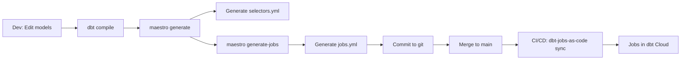

# Deployment Guide

This guide shows how to deploy selectors and jobs to dbt Cloud using CI/CD.

## Overview

**dbt-job-maestro** generates YAML files that define your selectors and jobs:
- `selectors.yml` - dbt selector definitions
- `jobs.yml` - dbt Cloud job definitions

**dbt-jobs-as-code** (from dbt-labs) deploys these files to dbt Cloud via API.

## Workflow



## Setup

### 1. Install dbt-job-maestro

```bash
pip install dbt-job-maestro
```

### 2. Create config

```bash
maestro init
```

Edit `maestro-config.yml`:

```yaml
manifest_path: target/manifest.json
selectors_output_file: selectors.yml
jobs_output_file: jobs.yml

selector:
  exclude_tags:
    - deprecated

job:
  account_id: 12345
  project_id: 67890
  environment_id: 11111
  threads: 8
  target_name: prod
  orchestration_mode: staggered  # simple | staggered | none
  cron_schedule: "0 6 * * *"    # base schedule (staggered mode staggers from here)
```

### 3. Generate selectors and jobs

```bash
dbt compile
maestro generate --config maestro-config.yml
maestro generate-jobs --config maestro-config.yml
```

### 4. Commit and push

```bash
git add selectors.yml jobs.yml maestro-config.yml
git commit -m "Update selectors and jobs"
```

## CI/CD Setup

### GitHub Actions

Create `.github/workflows/deploy-dbt-jobs.yml`:

```yaml
name: Deploy DBT Jobs

on:
  push:
    branches: [main]
    paths: ['jobs.yml', 'selectors.yml']

jobs:
  deploy-jobs:
    runs-on: ubuntu-latest
    steps:
      - uses: actions/checkout@v4

      - uses: actions/setup-python@v5
        with:
          python-version: '3.10'

      - name: Install dbt-jobs-as-code
        run: pip install dbt-jobs-as-code

      - name: Deploy jobs to dbt Cloud
        env:
          DBT_CLOUD_SERVICE_TOKEN: ${{ secrets.DBT_CLOUD_SERVICE_TOKEN }}
        run: dbt-jobs-as-code sync-jobs jobs.yml
```

**Required Secrets:**
- `DBT_CLOUD_SERVICE_TOKEN`: Create in dbt Cloud → Account Settings → Service Tokens (needs "Job Admin" permissions)

### GitLab CI

```yaml
deploy-dbt-jobs:
  stage: deploy
  image: python:3.10
  only:
    - main
  changes:
    - jobs.yml
    - selectors.yml
  script:
    - pip install dbt-jobs-as-code
    - dbt-jobs-as-code sync-jobs jobs.yml
  variables:
    DBT_CLOUD_SERVICE_TOKEN: $DBT_CLOUD_SERVICE_TOKEN
```

### Manual Deployment

```bash
pip install dbt-jobs-as-code
export DBT_CLOUD_SERVICE_TOKEN=<your-token>
dbt-jobs-as-code sync-jobs jobs.yml
```

## Branch Protection

Configure branch protection to prevent concurrent deployments:

### GitHub

1. Go to Settings > Branches
2. Add rule for `main` branch
3. Enable:
   - Require pull request reviews
   - Require status checks to pass
   - Do not allow bypassing

### GitLab

1. Go to Settings > Repository > Protected Branches
2. Select `main` branch
3. Set:
   - Allowed to merge: Maintainers
   - Allowed to push: No one

## Validation

Before deploying, validate your setup using the `maestro check` command:

```bash
# Basic check
maestro check

# Check with config file
maestro check --config maestro-config.yml

# Check specific dbt project directory
maestro check --dbt-project ./my-dbt-project
```

This validates:
- dbt-jobs-as-code package is installed
- Current git branch matches deployment branch
- packages.yml configuration
- Required files exist (selectors.yml, jobs.yml)

Or use the Python API:

```python
# validate_deployment.py
from dbt_job_maestro.deployment import validate_deployment_requirements

is_valid, issues = validate_deployment_requirements(
    dbt_project_path=".",
    deploy_branch="main"
)

if not is_valid:
    print("❌ Deployment validation failed:")
    for issue in issues:
        print(f"  - {issue}")
    exit(1)

print("✅ Deployment requirements validated")
```

## Troubleshooting

### Issue: "dbt-jobs-as-code not found"

**Solution:**

```bash
# Add to packages.yml
packages:
  - git: https://github.com/dbt-labs/dbt-jobs-as-code.git
    revision: main

# Install
dbt deps
```

### Issue: "DBT_CLOUD_SERVICE_TOKEN not set"

**Solution:**

1. Create service token in dbt Cloud:
   - Account Settings → Service Tokens
   - Create token with "Job Admin" permissions
2. Add to CI/CD secrets:
   - GitHub: Settings → Secrets → Actions
   - GitLab: Settings → CI/CD → Variables

### "Jobs not updating in dbt Cloud"

```bash
# Check job identifiers are stable
cat jobs.yml

# Verify dbt Cloud IDs are correct
maestro info --manifest target/manifest.json

# Verbose sync
dbt-jobs-as-code sync-jobs jobs.yml --verbose
```

### "Airflow DAG not appearing / import errors"

```bash
# Validate the generated DAG with Airflow's DagBag
pip install "dbt-job-maestro[airflow]"
python -c "from airflow.models import DagBag; b=DagBag('.', include_examples=False); print(b.import_errors)"
```

If `dbt: command not found` at runtime, ensure `dbt` is installed on the Airflow
worker and set `dbt_project_dir` / `dbt_profiles_dir` in the `airflow:` config so
the generated commands include `--project-dir` / `--profiles-dir`.

## Best Practices

### 1. Deploy only from CI/CD on merge to main

Never deploy manually from local machines. Use branch protection to enforce this.

### 2. Version control everything

```bash
git add selectors.yml jobs.yml maestro-config.yml
git commit -m "Update job definitions"
```

### 3. Review changes before merging

```bash
git diff main -- selectors.yml jobs.yml
dbt list --selector <selector_name>  # test selectors locally
```

### 4. Use consistent naming

```yaml
job:
  job_name_prefix: mycompany_dbt
```

Results in jobs named: `mycompany_dbt_stg_customers`

### 5. Regenerate when models change

```bash
dbt compile
maestro generate --config maestro-config.yml
maestro generate-jobs --config maestro-config.yml
git diff selectors.yml jobs.yml
```

## Advanced: Pre-commit Hooks

Ensure selectors and jobs stay in sync with model changes:

```yaml
# .pre-commit-config.yaml
repos:
  - repo: local
    hooks:
      - id: generate-selectors
        name: Generate DBT Selectors
        entry: bash -c 'dbt compile && maestro generate --config maestro-config.yml'
        language: system
        pass_filenames: false

      - id: generate-jobs
        name: Generate DBT Jobs
        entry: maestro generate-jobs --config maestro-config.yml
        language: system
        pass_filenames: false
```

Install:

```bash
pip install pre-commit
pre-commit install
```

## Support

- **dbt-job-maestro**: https://github.com/yourusername/dbt-job-maestro
- **dbt-jobs-as-code**: https://github.com/dbt-labs/dbt-jobs-as-code
- **dbt Cloud API**: https://docs.getdbt.com/dbt-cloud/api-v2
